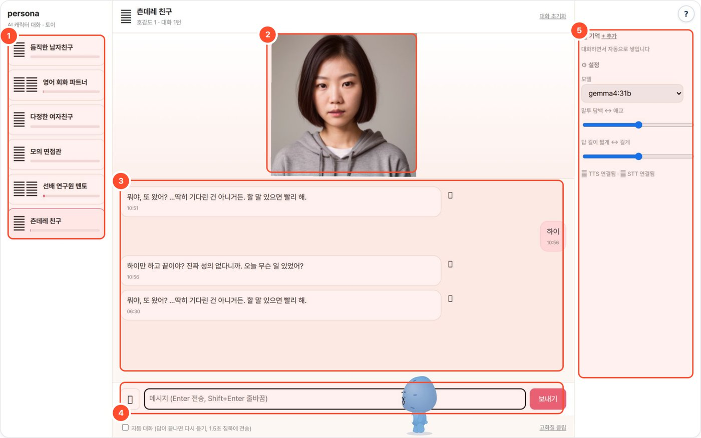

# persona-local — AI 캐릭터 대화 (개인 토이)

> 캐릭터를 골라 대화하면, 대화에서 뽑은 기억·호감도를 다음 응답에 붙이고, 연결된 TTS·STT 도구로 음성을 주고받는 로컬 LLM 캐릭터 채팅. 여자친구/남자친구/선배 멘토/모의 면접관/영어 회화 파트너/츤데레 친구 6종.
> **개인 토이 프로젝트**입니다. 사내 에이전트 포털 목록에는 노출하지 않습니다(tools.json `hidden`). 파이썬 표준 라이브러리 + sqlite, 외부 통신 없음.



화면의 얼굴은 저장소에 동봉된 AI 생성 가상 인물 초상(`personas/tsundere.png`)입니다.

## 무엇을 하나
- `personas/*.md` 한 파일이 캐릭터 하나 — 성격·말투·첫인사를 정의합니다.
- 매 턴 뒤 사용자에 대한 사실을 뽑아 **기억**으로 저장하고 다음 턴에 넣습니다. 호감도는 턴마다 오르는 재미용 수치입니다.
- tts-local(음성 답변), meeting-local(받아쓰기), avatar-local(고화질 립싱크 클립)이 떠 있으면 연결합니다.

## 사용 방법
번호는 위 화면의 번호 상자와 같습니다.

1. **캐릭터 목록**(①) — 대화 상대를 고릅니다. 카드 아래 막대가 호감도입니다.
2. **아바타**(②) — 답변을 재생하면 소리 크기에 맞춰 입이 움직이는 캔버스 아바타입니다(음량 기반 연출).
3. **대화 기록**(③) — 응답을 읽고, TTS가 연결돼 있으면 🔊 로 다시 듣습니다.
4. **텍스트·마이크**(④) — 글을 입력하거나 🎤 로 녹음해 meeting-local STT로 받아씁니다. 음성 기능에는 연결된 STT·TTS 서버가 필요합니다.
5. **기억·설정**(⑤) — 추출된 사실이 틀리면 고치거나 지우고, 모델·말투·답 길이를 조절합니다.

## 예시
기존 실행 결과(2026-10-06, `persona.db` messages 테이블의 tsundere 대화):

- 캐릭터: **츤데레 친구** · 텍스트 입력: `하이`
- 응답: “하이만 하고 끝이야? 진짜 성의 없다니까. 오늘 무슨 일 있었어?”

## 설치·실행
```bash
bash setup.sh                     # LLM 탐색 → selftest → http://localhost:8776
python3 app.py --cli gf "나 오늘 라멘 먹었어"
LLM_BASE_URL=http://localhost:11436 LLM_MODEL=gemma4:31b python3 app.py   # 로컬 Ollama + gemma4:31b (포털 기본값)
TTS_BASE_URL=http://localhost:8771/v1 python3 app.py   # tts-local 이 떠 있으면 🔊 버튼
```

| 환경변수 | 기본 | 설명 |
|---|---|---|
| `LLM_API` / `LLM_BASE_URL` / `LLM_MODEL` / `LLM_API_KEY` | ollama / :11434 / qwen3:8b | 다른 패키지와 동일 규약. 포털이 띄울 때는 로컬 Ollama `:11436` + `gemma4:31b` |
| `TTS_BASE_URL` | (없음) | OpenAI 호환 `/v1/audio/speech` (tts-local :8771) — 있으면 음성 답변·🔊 |
| `STT_BASE_URL` | `http://localhost:8767/v1` | OpenAI 호환 `/v1/audio/transcriptions` (meeting-local) — 있으면 🎤 |
| `AVATAR_URL` | `http://localhost:8777/api/run` | avatar-local 이 떠 있으면 "고화질 클립" 버튼 |
| `WORKSPACE` | `_workspace/` | `persona.db`(대화·기억·호감도) 위치. 포털이 `AGENT_DATA/persona-local` 로 지정 |
| `PORT` | 8776 | |

## 음성 대화 + 아바타
```bash
(cd ../meeting-local && WHISPER_MODEL=small bash setup.sh)   # STT  :8767  (/v1/audio/transcriptions)
(cd ../tts-local && bash setup.sh)                            # TTS  :8771  (/v1/audio/speech)
TTS_BASE_URL=http://localhost:8771/v1 STT_BASE_URL=http://localhost:8767/v1 python3 app.py
```
- 🎤 **누르고 말하기** → 받아쓰기 → LLM → 답이 끝나면 캐릭터 목소리로 재생. **자동 대화** 체크 시 재생이 끝나면 다시 듣고, 1.5초 침묵에 전송(핸즈프리).
- **아바타**: `personas/<name>.png` 이미지(동봉은 AI 생성 가상 인물 초상 — 생성한 캐릭터 그림으로 교체 가능, 실존 인물 사진 금지). 이미지를 한 번 클릭해 입 위치를 지정하면(캐릭터별 저장) 재생 중 소리 크기에 맞춰 입이 움직이고, 3~6초마다 깜빡이고, 몸이 살짝 흔들리고, 눈이 커서를 따라갑니다. 전부 canvas·Web Audio, 라이브러리 없음.
- **고화질 클립**: avatar-local(:8777)이 떠 있으면 마지막 답변을 립싱크 mp4로 생성(수 분). 결과는 avatar-local 쪽에서 열립니다.
- 전신 실사 동작(걷기·제스처)은 GPU 서버에서 붙일 자리입니다. 후보: MusePose(Apache-2.0, 포즈 기반), MimicMotion(Tencent, 연구용 라이선스 확인 필요), Champ(MIT, SMPL 기반), AnimateAnyone 재구현(Moore-AnimateAnyone, Apache-2.0). 여기서는 구현하지 않음.

## 동작
- **페르소나**: `personas/*.md` 한 파일 = 한 캐릭터(frontmatter name/title/avatar/voice/greeting, `---` 아래가 시스템 프롬프트). 파일 추가하면 끝.
- **기억**: 매 턴 뒤 작은 2차 콜로 사용자에 대한 사실(이름·취향·일정…)을 `key=value` 로 뽑아 저장하고, 다음 턴 시스템 프롬프트에 `[기억]` 으로 넣음. 오른쪽 패널에서 수정·삭제.
- **호감도**: 턴마다 +1(최대 100), 카드의 바. 재미용.
- **먼저 인사**: 8시간 넘게 안 보면 기억 하나를 언급하며 먼저 말을 겁니다.
- **말투·길이 슬라이더**, 모델 선택, 대화 초기화(기억은 유지).

## 한계
- 최근 20턴만 모델에 들어감(요약 압축 없음). 8B 모델은 캐릭터가 가끔 흔들림 → 큰 모델 권장.
- 사실 추출은 LLM 판단이라 엉뚱한 기억이 들어올 수 있음 → 패널에서 지우면 됨.

## 출처·감사 (Credits)

- 페르소나는 이 패키지를 위해 지어낸 가상 인물입니다.
- `personas/*.png` — AI 로 생성한 가상 인물 초상(실존 인물 아님). [SG161222/Realistic_Vision_V5.1](https://huggingface.co/SG161222/Realistic_Vision_V5.1_noVAE) (Stable Diffusion 1.5 계열, CreativeML OpenRAIL-M) + [stabilityai/sd-vae-ft-mse](https://huggingface.co/stabilityai/sd-vae-ft-mse). 생성 스크립트 `scripts/gen_faces.py`
- 음성·아바타 연결(선택): [tts-local](https://github.com/gggg8657/tts-local), [meeting-local](https://github.com/gggg8657/meeting-local)(STT), [avatar-local](https://github.com/gggg8657/avatar-local)
- **LLM 실행** — OpenAI 호환 API 로 호출합니다(모델 가중치는 동봉하지 않음). 기본 배포는 [Ollama](https://github.com/ollama/ollama) (MIT) 위의 Google [Gemma](https://ai.google.dev/gemma) `gemma4:31b` — 모델 이용 조건은 Gemma 배포처 참고.
- 이 도구는 [agent-page-portal](https://github.com/gggg8657/agent-page-portal) 에 연결해 쓰도록 만들었습니다(단독 실행도 됨).

저작권 표기·전체 목록은 `NOTICE` 를 보세요.
